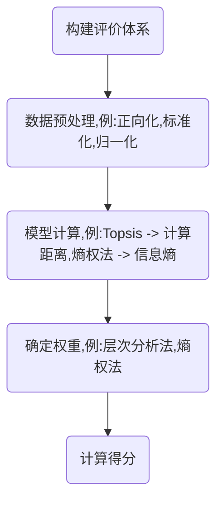

# 评价类算法总结

## 评价

想要完成评价,需要确定两件事情:

1.确定**评价对象**,例如一件事,一个人

2.确定评价**对象指标**,即用什么评价

## 完成评价思路流程图

## 数据处理时针对的对象

\[
正向化,标准化,归一化 \longrightarrow 同一指标进行处理 \\[10pt]
求差值,求距离 \longrightarrow 跨对象处理 \\[10pt]
求权重 \longrightarrow 跨指标处理(权重之和为1) \\[10pt]
求得分 \longrightarrow 同一对象处理
\]

## 模型适用对比

| 模型         | 优点                                                         | 缺点                                                         | 适用情况                                                     |
|--------------|--------------------------------------------------------------|--------------------------------------------------------------|--------------------------------------------------------------|
| 层次分析法   | 1. 简洁实用，把定性与定量方法有机结合起来； 2. 所需要的定量数据信息比较少。 | 1. 主观性较高，不易令人信服； 2. 不适用于大量指标的情况。 | 1. 定性定量指标，数据量小； 2. 决策变量少，层次分明的多指标决策问题，比如政策评估、项目选择。 |
| Topsis法     | 1. 大小样本均适用； 2. 避免了数据的主观性和主观性造成的复杂过程。 | 1. 需要每个指标的数据，且部分指标的量化和最优值选取会有一定难度； 2. 受极端值影响较大，依赖归一化处理。 | 1. 定量指标，数据量大小都合适； 2. 可量化指标清晰，数据精度较高的排序决策问题，如供应商选择、绩效评估。 |
| 熵权法       | 1. 完全客观，不受人为影响。                                   | 1. 忽略专家主观判断，忽略了指标本身重要程度，易受数据波动性不平衡影响。 | 1. 定量指标，数据量大（n≥5）； 2. 无法通过认知或文献等其他途径判断各因素的重要程度。 |
| 模糊综合评价 | 1. 通过精确的数字手段处理模糊的评价对象。                     | 1. 指定隶属函数时主观性较强，计算相对复杂。                   | 1. 定性定量指标，数据量少； 2. 评价因素不确定或存在模糊描述的问题，如社会评价、风险分析。 |
| 灰色关联分析 | 1. 对于数据分析没有太大要求。                                 | 1. 需要对各项指标的最优值进行现行确定，主观性过强，部分指标最优值难以确定； 2. 对指标的绝对大小不敏感。 | 1. 定量指标，数据量少； 2. 适合相对变化的比较，变化趋势分析场景，如经济指标关联分析。 |

| 模块         | 层次分析法 | Topsis法 | 熵权法 | 模糊综合评价 | 灰色关联分析 |
|--------------|------------|----------|--------|--------------|--------------|
| 评价决策     | √          | √        | ×      | √            | √            |
| 权重计算     | √          | ×        | √      | ×            | ×            |
| 数据类型     | 定性+定量  | 定量     | 定量   | 定性+定量    | 定量         |
| 数据量       | 数据量小   | 数据量多 | 数据量多 | 数据量小     | 数据量小     |

**数据量要求**：大多数评价类算法不依赖于大样本，但至少需要每个方案在每个指标上有完整数据，且要有一定差异。

## 评价问题共性

1.只能在已有指标上找最优

2.指标不能太多,否则权重过低

3.主观性太高就不客观,过于客观又依赖于数据

4.对数据分布无要求

## 标准化数据的目的

1.消除量纲

2.消除指数级数据的干扰

3.适应特定算法的数据要求

4.保持方向一致性(正向化)

## 标准化方式对比

| 标准化 | 公式 | 作用 | 评价算法 | 应用场景 |
|--------|------|------|----------|----------|
| 标准差标准化 (Z-score) | 
\( \frac{X - \mu}{\sigma} \)
 | 去除量纲，将数据转变为均值为0，标准差为1，使其具有可比性，不改变数据的分布形状 | / | 一般是机器学习的前置步骤 |
| 标准差缩放 | 
\( \frac{X}{\sigma} \)
 | 将数据进行缩放，但保留数据的相对大小关系（即数据需要比较均值），使其标准差为1，不改变数据的分布形状 | / | 需要比较均值以及相对波动的场景 |
| 极差标准化 | 
\( \frac{X - X_{\text{min}}}{X_{\text{max}} - X_{\text{min}}} \)
 | 将数据缩放到[0,1]区间内，计算数据占整个分布区间的比例 | Topsis法 | 用于确定数据区间的压缩运算 |
| 负向转正向极差 | 
\( \frac{X_{\text{max}} - X}{X_{\text{max}} - X_{\text{min}}} \)
 | 将数据缩放到[0,1]区间内，计算数据的占比，其和为1 | 熵权法 |  |
| 比例归一化 | 
\( \frac{X}{\sum X} \)
 | 将数据缩放到[0,1]区间内，计算数据的占比，其和为1 | 层次分析法 熵权法 | 数据样本不多，一般只用于评价问题，对行进行操作会将数据映射到单形空间，此时数据不适用于任何机器学习类算法 |
| 向量归一化 | 
\( \frac{X}{\lvert \lvert X_n \rvert \rvert} \)
 | 计算赋范空间中的模长，分离向量的大小与方向，转变后只保留方向信息，不保留大小信息 | Topsis法 熵权法 | 适用于不关注数据大小，只关注数据方向的情况，常用于数学、物理中各类矢量场的分析，计算欧式距离 |

**数据量要求**：大多数评价类算法不依赖于大样本，但至少需要每个方案在每个指标上有完整数据，且要有一定差异。
