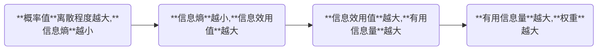

# 熵权法

目的是为了给各个指标顶权重

**指标数据离散程度越大，对综合评价的区分作用越强，权重越高**

## 物理熵与信息熵关系

\[
物理熵 \xrightarrow[]{正向化，标准化，归一化} 信息熵 \\[12pt]
物理熵(系统越混乱)越大，信息熵(不确定性越小)越小
\]

## 信息熵各个名词之间的关系

**信息熵**:信息熵值反映了一个离散随机变量X的平均信息度，为了确定一个信号中包含了多少信息 $e_j \in [0,1]$
**信息效用值**:包含了多少有效信息
**熵权**:根据信息熵定的权重

## 思路流程图

## 求解步骤

### 1.正向化

同Topsis法，将指标归正

### 2.标准化

\[
z_{ij} = \frac{x_{ij}}{\sqrt{\sum_{i=1}^n x^2_{ij}}}
\]

### 3.归一化

\[
p_{ij} = \frac{z_{ij}}{\sum^n_{ij}z_{ij}}
\]

### 4.求信息熵,信息效用值,进而求熵权

\[
信息熵: e_j = -\frac{1}{\ln(n)} \sum^n_{i = 1} p_{ij} \ln(p_{ij}) \\[8pt]
信息有效值: d_j = 1 - e_j \\[8pt]
熵权: \frac{d_j}{\sum^m_{j = 1}d_j}
\]