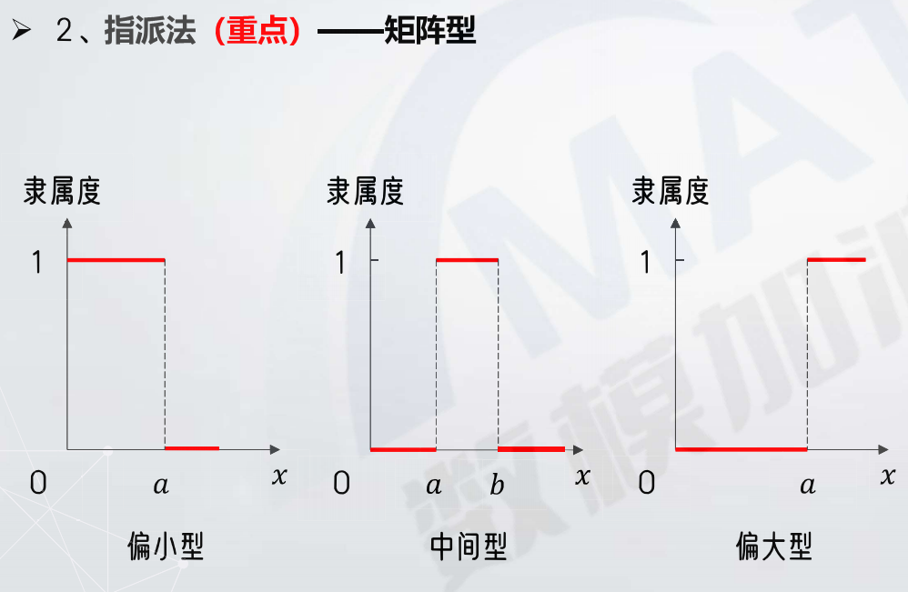
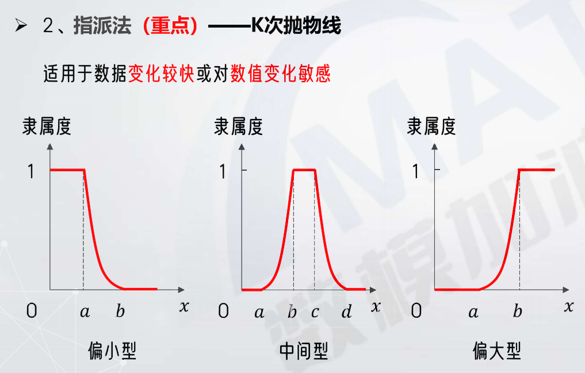
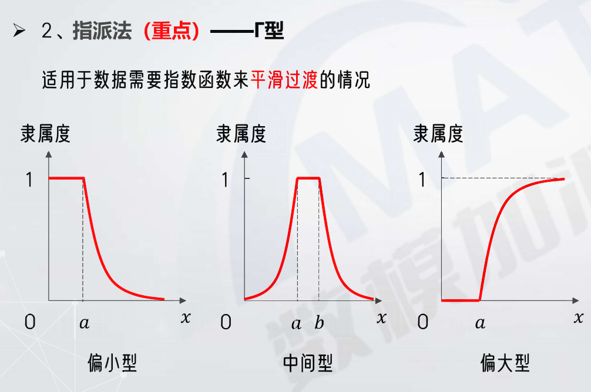
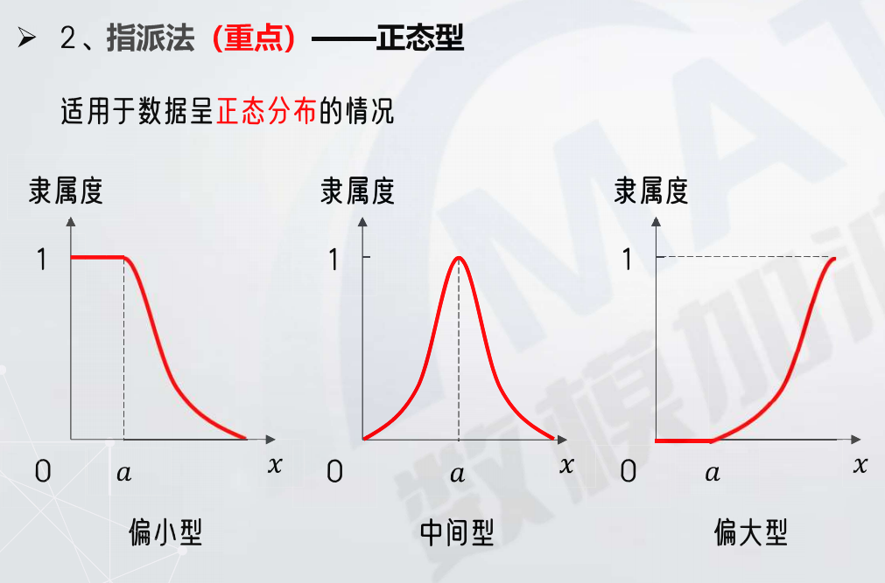
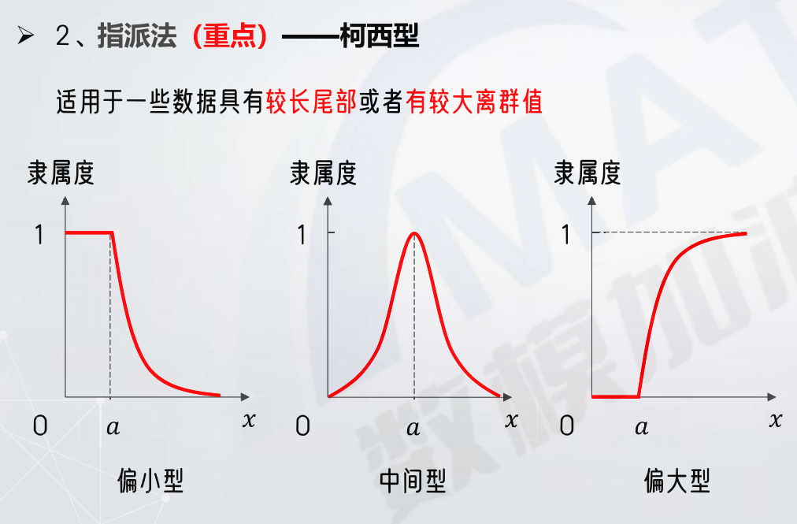

# 模糊综合评价

通过隶属函数,处理界限模糊的概念,使评价量化

**核心**:确定隶属函数

**隶属函数**:通过对意见的统计分析,确定[0,1]的映射关系,但隶属函数本身不确定,需要认为确定

**隶属度**:符合条件的程度

## 隶属度类型

### 1.偏大型
### 2.中间型
### 3.偏小型

类似于Topsis的正向化,但是计算隶属度的函数不确定

## 隶属函数确定方式

### 1.模糊统计法(较为主观,不常用)

通过调查问卷,专家评估等用频率确定隶属度

### 2.指派法(较常用)

#### 矩阵型

\[
偏小型: \mu_A = \begin{cases}
1, \qquad & x \leq a \\
0, & x > a
\end{cases} \\[8pt]
中间型: \mu_A = \begin{cases}
1, \qquad & a \leq x \leq b \\
0, & x < a或x > b
\end{cases} \\[8pt]
偏大型: \mu_A = \begin{cases}
1, \qquad & x \geq a \\[8pt]
0, & x < a
\end{cases}
\]

#### 梯形型

\[
偏小型: \mu_A = \begin{cases}
1, \qquad & x \leq a \\[8pt]
\dfrac{b-x}{b-a}, & a \leq x \leq b \\[8pt]
0, & x > b
\end{cases} \\[8pt]
中间型: \mu_A = \begin{cases}
\dfrac{x-a}{b-a}, \qquad & a \leq x \leq b \\[8pt]
1, & b \leq x \leq c \\[8pt]
\dfrac{d - x}{d - c}, & c \leq x \leq d \\[8pt]
0, & x < a,x \geq b
\end{cases} \\[8pt]
偏大型: \mu_A = \begin{cases}
0, \qquad & x < a \\[8pt]
\dfrac{x - a}{b - a}, & a \leq x \leq b \\[8pt]
1, & x > b
\end{cases}
\]

#### k次抛物线型

\[
偏小型: \mu_A = \begin{cases}
1, \qquad & x \leq a \\[8pt]
(\dfrac{b - x}{b - a})^k, & a \leq x \leq b \\[8pt]
0, & x > b
\end{cases} \\[8pt]
中间型: \mu_A = \begin{cases}
(\dfrac{x - a}{b - a})^k, \qquad & a \leq x \leq b \\[8pt]
1, & b \leq x \leq c \\[8pt]
(\dfrac{d - x}{d - c})^k, & c \leq x \leq d \\[8pt]
0, & x < a, x \geq d
\end{cases} \\[8pt]
偏大型: \mu_A = \begin{cases}
0, \qquad & x < a \\[8pt]
(\dfrac{x - a}{b - a})^k, & a \geq x \geq b \\[8pt]
1, & x > b
\end{cases}
\]

#### $\Gamma$型

\[
偏小型: \mu_A = \begin{cases}
1, \qquad & x \leq a \\[8pt]
e^{-k(x-a)}, & x > a
\end{cases} \\[8pt]
中间型: \mu_A = \begin{cases}
e^{k(x - a)}, \qquad & x < a \\[8pt]
1, & a \leq x \leq b \\[8pt]
e^{-k(x-b)}, & x > b
\end{cases} \\[8pt]
偏大型: \mu_A = \begin{cases}
0, \qquad & x < a \\[8pt]
1 - e^{-k(x - a)}, & x \geq a
\end{cases}
\]

#### 正态型

\[
偏小型: \mu_A = \begin{cases}
1, \qquad & x \leq a \\[8pt]
exp \left\{ -\Big(\dfrac{x - a}{\sigma}^2 \Big ) \right\}, & x > a
\end{cases} \\[8pt]
中间型: \mu_A = exp \left\{ -\Big(\dfrac{x - a}{\sigma}^2 \Big ) \right\} \\[8pt]
偏大型: \mu_A = \begin{cases}
0, \qquad & x \leq a \\[8pt]
1 - exp \left\{ -\Big(\dfrac{x - a}{\sigma}^2 \Big ) \right\}, & x > a
\end{cases}
\]

#### 柯西型

\[
偏小型: \mu_A = \begin{cases}
1, \qquad & x \leq a \\[8pt]
\dfrac{1}{1 + \alpha(x - a)^{\beta}}, & x > a
\end{cases} \\[8pt]
(\alpha > 0, \beta > 0) \\[8pt]
中间型: \mu_A = \dfrac{1}{1 + \alpha(x - a)^{\beta}} \\[8pt]
(\alpha > 0, \beta 为正偶数) \\[8pt]
偏大型: \mu_A = \begin{cases}
0, \qquad & x \leq a \\[8pt]
\dfrac{1}{1 + \alpha(x - a)^{\beta}}, & x > a
\end{cases} \\[8pt]
(\alpha > 0, \beta > 0) \\[8pt]
\]

### 3.其他方法

利用已有的值当作隶属度

## 计算隶属值(由隶属函数得出)

## 定权重(层次分析法,熵权法)

## 加权的综合得分
