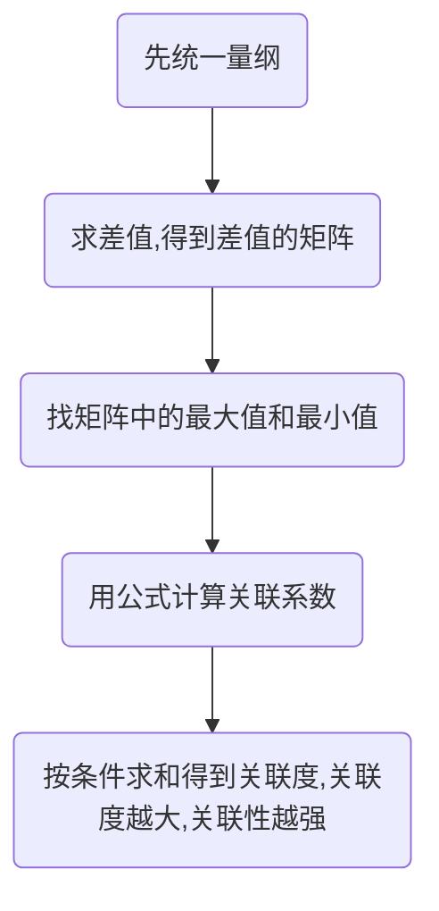
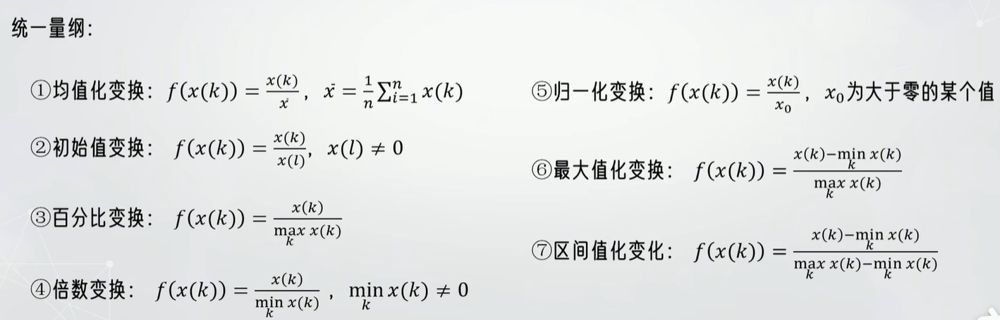

# 灰色关联分析

计算变量之间的关联度

**灰色**:介于白色(完全已知,完全可预测)与黑色(完全未知,完全无法预测或分析),部分信息已知,存在一定的不确定和模糊性

**核心**:求母序列和子序列的差值

## 思路流程图

在实际中常类似于Topsis法先得最优数据做母序列,在进行做差

## 求解步骤

### 1.正向化,统一量纲

正向化参考Topsis法

统一量纲:

#### (1)均值化变换

\[
f(x(k) = \frac{x(k)}{x(l)} )，\quad (x(l) \neq 0)
\]

#### (2)初始化变换

\[
f(x(k) = \frac{x(k)}{x}), \quad (x = \frac{1}{n} \sum_{i=1}^n x(k))
\]

#### (3)百分比变换

\[
f(x(k)) = \frac{x(k)}{\max_k x(k)}
\]

#### (4)倍数变换

\[
f(x(k)) = \frac{x(k)}{\min_k x(k)}, \quad (\min_k x(k) \neq 0)
\]

#### (5)归一化变换

\[
f(x(k)) = \frac{x(k)}{x_0}, \quad x_0为大于零的某个值
\]

#### (6)最大值化变换

\[
f(x(k)) = \frac{x(k) - min_k x(k)}{max_k x(k)}
\]

#### (7)区间值化变换

\[
f(x(k)) = \frac{x(k) - min_k x(k)}{max_k x(k) - min_k x(k)}
\]

### 2.从每一列中找到最大值组成母序列

### 3.计算所有子序列与母序列的差值,组成新矩阵

\[
X_i(k) = |X_i(k) - MAX(k)|
\]

### 4.计算关联系数

\[
\xi_{ij} = \frac{a + \rho}{x_{ij} + \rho b} \qquad \begin{cases}
\rho 为分辨系数且 \rho \in [0,1] \begin{cases}
\rho 越大,关联系数间的差异就越小 \\[8pt]
\rho 越小,关联系数间的差异就越大 \\[8pt]
\end{cases} \\[8pt]
a = min_i min_k |x_i(k) - max(k)| 为所有数据中的最小值 \\[8pt]
b = max_i max_k |x_i(k) - max(k)| 为所有数据中的最大值
\end{cases}
\]

### 5.求关联度(可用熵权法,层次分析法求权重)

默认权重都相等:

\[
r_j = \frac{1}{n} \sum^n_{k = 1} \xi_i(k) \qquad 对象的所有指标相加取平均数
\]
