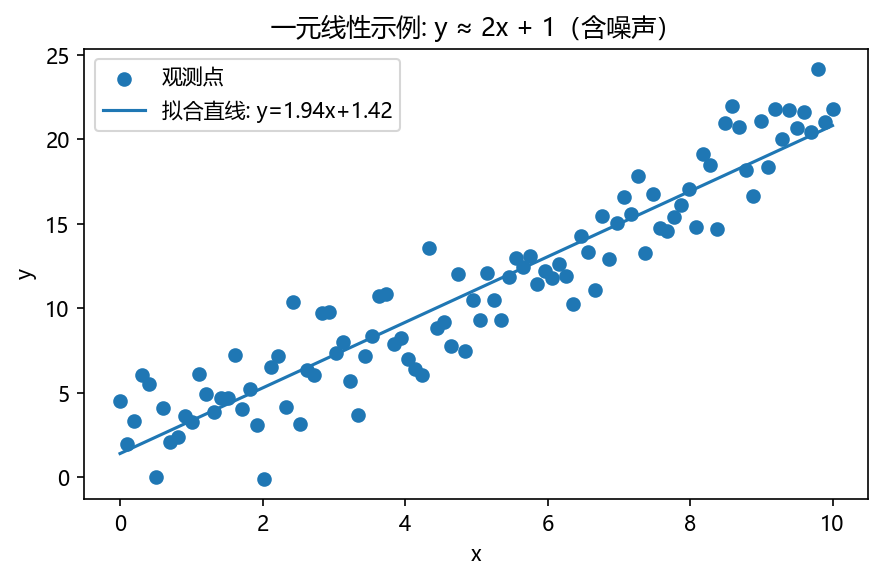
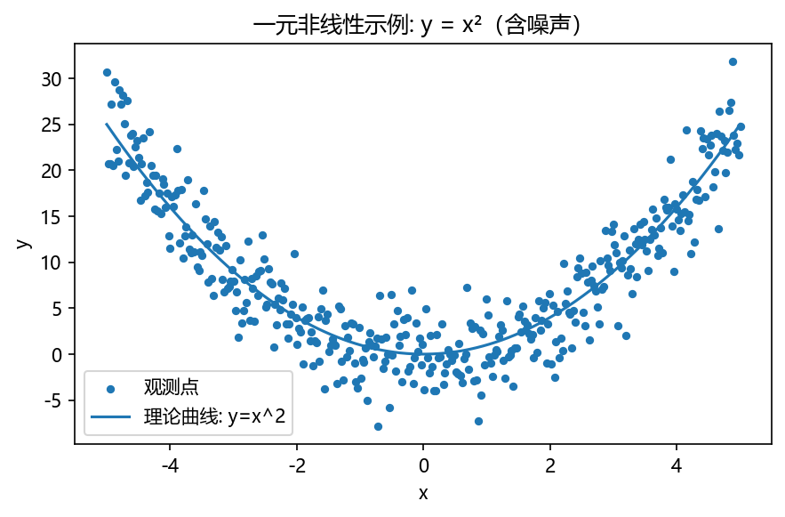
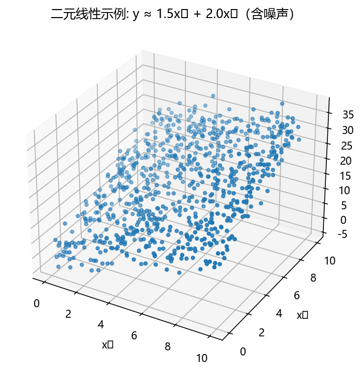
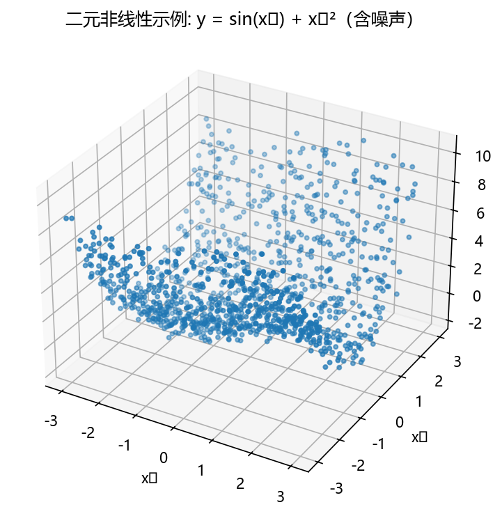

# 一元线性回归回归分析

## 名词解释

### 线性关系

x与y关系表示为一条直线,多个x与y关系表示为平面

| 一元线性 | 一元非线性 | 二元线性 | 二元非线性 |
|:---:|:---:|:---:|:---:|
|  <code>univariate_linear.png</code> |  <code>univariate_nonlinear.png</code> |  <code>bivariate_linear.png</code> |  <code>bivariate_nonlinear.png</code> |

### 回归

预测一个连续问题的数值

线性回归主要用于处理回归问题,少数用于分类

### 一元线性回归

找到两个变量的直线关系,让数据靠近直线

\[
Y = \beta_0 + \beta_1 X + \epsilon \qquad \begin{cases}
Y: 因变量(预测值) \\[5pt]
X: 自变量(用于预测的值) \\[5pt]
\beta_0: 截距(与Y轴的交点) \\[5pt]
\beta_1: 斜率(当X增加一个单位时,Y的变化量) \\[5pt]
\epsilon: 实际值与预测值的差异(实测数据到拟合直线的距离)
\end{cases}
\]

其中$\epsilon越小,模型越拟合$

**核心思想**:

(1) 目标:找到一条最佳直线来描述两个变量关系

(2) 方法:让直线与**所有**数据点的距离综合最小(最小二乘法/贪心?)

(3) 结果:得到预测公式

## 算法评价指标

>> 注:需先对数据进行分析,再选择模型和评论指标,一般用计算机去计算$\beta_0,\beta_1和\epsilon$

### 1. $R^2$:决定系数

\[
R^2 = 1 - \frac{SSE}{SST} = 1 - \frac{\sum (y_i - \hat {y_i})^2}{\sum (y_i - \bar {y_i})^2} \qquad \begin{cases}
SSE: 残差平方和 \\[5pt]
SST: 总平方和 \\[5pt]
\hat {y_i}: 预测值 \\[5pt]
\bar {y} : 实际值的平均数
\end{cases} \\[20pt]
\]

\[
R^2 \in [0,1] \qquad \begin{cases}
R^2 = 0 \quad & 完全无法解释数据变化 \\[5pt]
R^2 = 1 \quad & 完全可以解释数据变化 \\[5pt]
R^2 = 0.8 \quad & 可以解释80\%数据变化
\end{cases} \\[20pt]
\]

\[
实际中 \begin{cases}
R^2 > 0.7 \quad & 拟合较好 \\[5pt]
0.5 < R^2 > 0.7 \quad & 拟合一般 \\[5pt]
R^2 < 0.5 \quad & 拟合较差
\end{cases} \\[20pt]
\]

### 2.3. MSE均方误差 RMSE均方根误差

\[
MSE = \frac{1}{n} \sum^n_{i = 1}(y_i - \hat {y_i})^2 \\[10pt]
RMSE = \sqrt{\frac{1}{n} \sum^n_{i = 1}(y_i - \hat {y_i})^2} \\[10pt]
\]

\[
\begin{aligned}
&\text{特点:}\\
&1.\ \text{单位: 与因变量平方相同}\\
&2.\ \text{敏感: 对大的误差较为敏感}\\
&3.\ \text{取值: 越小越好}
\end{aligned}
\]

### 4. RMAE 平均绝对误差

\[
MAE = \frac{1}{n} \sum^n_{i = 1} |y_i - \hat{y_i}|
\]

\[
\begin{aligned}
&\text{特点:}\\
&1.\ \text{单位: 与因变量相同}\\
&2.\ \text{稳健性: 不受异常影响}\\
&3.\ \text{直观性: 容易理解和解释}
\end{aligned}
\]