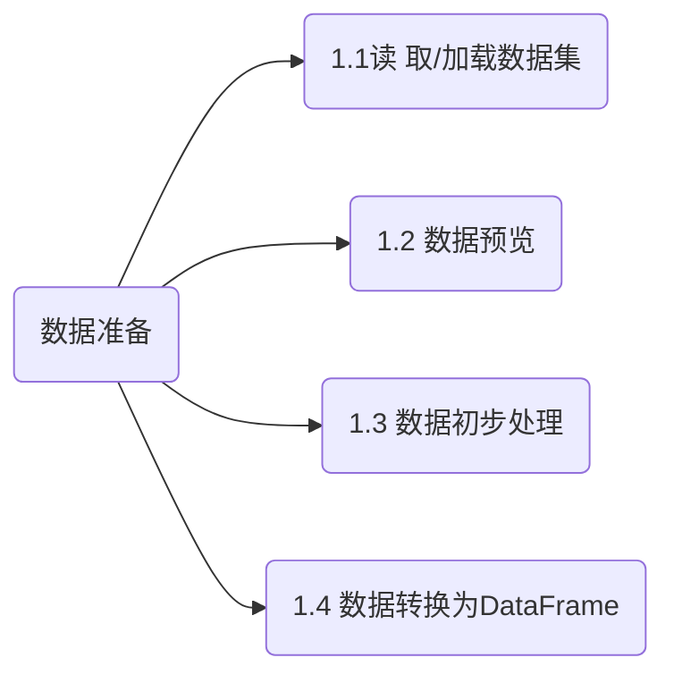
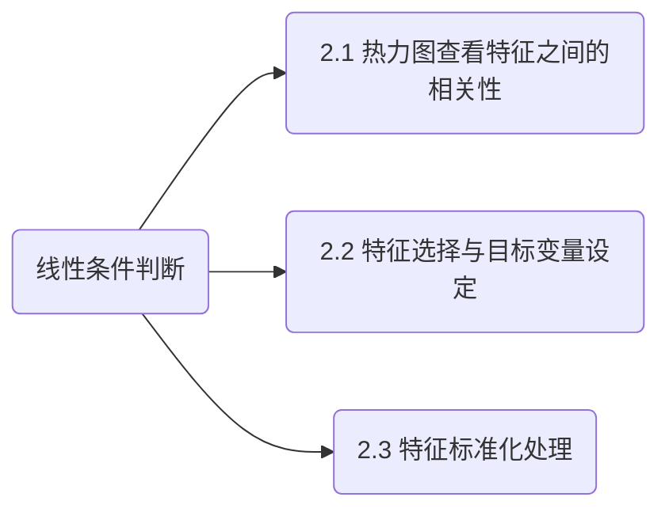

# 多元线性回归分析

## 含义分析

\[
x_1 + x_2 + \dots + x_n  + \epsilon = y \qquad \begin{cases}
x_n: 自变量,独立于自由变量的变量 \\[5pt]
\epsilon: 误差项 \\[5pt]
y: 非独立,受其他变量影响的变量
\end{cases} \\[15pt]
\]

\[
\beta_0 +\beta_1 X_1 + \beta_x X_2 + \dots + \beta_n + X_n + \epsilon = Y \qquad \begin{cases}
\epsilon: 误差项 \\[5pt]
\beta_1 , \beta_2 \dots : 回归系数(各个变量影响的程度) \\[5pt]
\beta_0 : 截距 \\[5pt]
X_1 , X_2 \dots X_p : 自变量(影响因素) \\[5pt]
Y: 因变量(需要预测的值)
\end{cases}
\]

其中要重点控制X的个数，**筛选关键因素(有正向关系)**的变量

当选对关键变量,$R^2$越接近1

## 对比一元线性分析

| 对比维度 | 一元线性回归 | 多元线性回归 |
| :---: | :---: | :---: |
| **模型举例** | y = 6.6 + 0.8x | y = 6.6 + 0.5x₁ + 0.1x₂ + 0.3x₃ |
| **自变量** | 仅一个自变量 | 多个自变量 |
| **自变量选择** | 强迫选择，只有一个 | **重中之重:逐步筛选（特征工程）** |
| **共线性** | 无 | 自变量之间要求无多重共线性影响(例:$x_n \neq n x_m$) |
| **回归系数** | 回归系数 | 偏回归系数 |
| **模型评价** | R² | 调整后的R² |
| **应用范围** | 一般作为中间分析过程 | 更广泛、用作变量关系研究的依据 |

## 建立模型流程

## 总结

### 多元线性回归通过组合多个具有解释性的特征来进行模型训练
- 能够有效提升预测的准确度。标准化处理帮助模型更快收敛，
- 回归系数可以解释每个变量对因变量的边际影响。
- 增加残差图可辅助判断模型是否存在非线性偏差；
- 交叉验证则帮助我们评估模型泛化能力；
- 残差的分布分析可以验证误差项的正态性，辅助后续改进建模方法；
- 保存结果有助于学生回顾学习过程并进行汇报展示。

