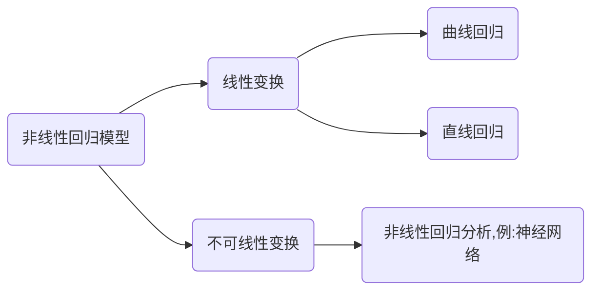

# 非线性回归分析 (需大量数据)

## 定义

研究因变量与自变量之间存在的非线性关系(无法用直线拟合)

## 原理对比

| 特性         | 线性回归                                                                 | 非线性回归                                                                 |
|:------------:|:--------------------------------------------------------------------------:|:----------------------------------------------------------------------------:|
| 数学表达式   | \(Y = \beta_0 + \beta_1 X_1 + \varepsilon\)                                | \(y = f(x, \theta) + \varepsilon\)                                          |
| 函数形式     | 直线、平面或超平面                                                       | 曲线、曲面，如指数函数、对数函数、幂函数等                                  |
| 计算复杂度   | 简单，有闭式解                                                           | **复杂，通常需要迭代求解**                                                  |
| 参数估计方法 | 最小二乘法                                                               | 非线性最小二乘法、最大似然估计、迭代算法                                     |
| 可解释性     | 系数直接表示变量对因变量的影响程度                                       | 参数解释相对复杂，需要结合函数形式                                          |
| 模型稳定性   | 稳定性好，不易**过拟合**                                                 | 稳定性相对较差，容易**过拟合**                                              |
| 样本量要求   | 对样本量要求相对较低                                                     | 通常需要**较大的样本量**                                                    |
| 适用场景     | 变量间关系简单、线性趋势明显                                             | 变量间关系复杂、存在非线性趋势                                               |
| 常见类型     | 简单线性回归，多元线性回归，多项式回归(线性于参数)                         | 指数回归，对数回归，幂函数回归，Logistic回归                                |
| 优点         | 计算简单快速，结果易于解释，统计推断完善，不易过拟合                       | 拟合能力强，能处理复杂关系，预测精度高，应用范围广                         |
| 缺点         | 只能处理线性关系，对非线性数据拟合差，模型表达能力有限                   | 计算复杂，容易过拟合，参数初值敏感，可能无法收敛                           |
| 评估指标     | R²、调整R²、AIC、BIC、F统计量                                             | R²、AIC、BIC、均方误差(MSE)、残差标准误                                      |
| 实际应用     | 经济学分析，市场研究，质量控制，简单预测模型                             | 生物学增长模型，药物动力学，工程系统建模，机器学习                          |

## 非线性回归模型类型

> 注:大部分曲线回归可经过调整变为线性回归,反向得到y

## 常见的曲线模型

| 曲线名称       | 曲线拟合模型表达式                                      |
| :------------: | :------------------------------------------------------: |
| 二次曲线       | \(y = \beta_0 + \beta_1 x + \beta_2 x^2\)                  |
| 三次曲线       | \(y = \beta_0 + \beta_1 x + \beta_2 x^2 + \beta_3 x^3\)    |
| 对数曲线       | \(y = \beta_0 + \beta_1 \ln x\)                           |
| 指数曲线       | \(y = \beta_0 e^{\beta_1 x}\)                             |
| 复合曲线       | \(y = \beta_0 \beta_1^x\)                                 |
| 增长曲线       | \(y = e^{\{\beta_0 + \beta_1 x\}}\)                       |
| S曲线          | \(y = e^{\{\beta_0 + \frac{\beta_1}{x}\}}\)                |

## 模型选择准则

目的:为了平衡复杂性和拟合性

\[
AIC(赤池信息准则): \begin{cases}
正向性: & 越小越好 \\[5pt]
模型特性: & 中等复杂,拟合较好 \\[5pt]
目的: & 优先保证拟合效果,预测场景
\end {cases}
\]

\[
BIC(贝叶斯信息准则): \begin{cases}
正向性: & 越小越好 \\[5pt]
模型特征: & 简单复杂,拟合中等 \\[5pt]
目的 : & 不利用大模型,在资源较少的情况下,解释数据规律
\end{cases}
\]

\[
调整R^2 : 考虑参数的个数影响(计算得分)
\]

## 确定好模型之后的步骤

### 初始值计算

 - 选择**合适的**初始值设置方法(经验法,线性化方法(曲变直),网格搜索法)
 - 计算各参数的初始**估计值**
 - 检查初始值的**合理性**

### 约束设定

 - 根据实际意义设置参数约束(例:液体水的温度为0-100之间)
 - 确保初始值在约束范围之内
 - 避免过于严格约束

### 迭代优化

 - 运行算法
 - 监控收敛过程数据
 - 必要时调整初始值或者约束

## 建立模型步骤

 - 准备数据
 - 绘制散点图
 - 确立模型
 - 初始化参数
 - 绘制图像(检查模型是否选对没有,$R^2 \geq 0.7$)
 - 检验模型(残差分析(是否满足正态分布),交叉验证(是否过拟合))
