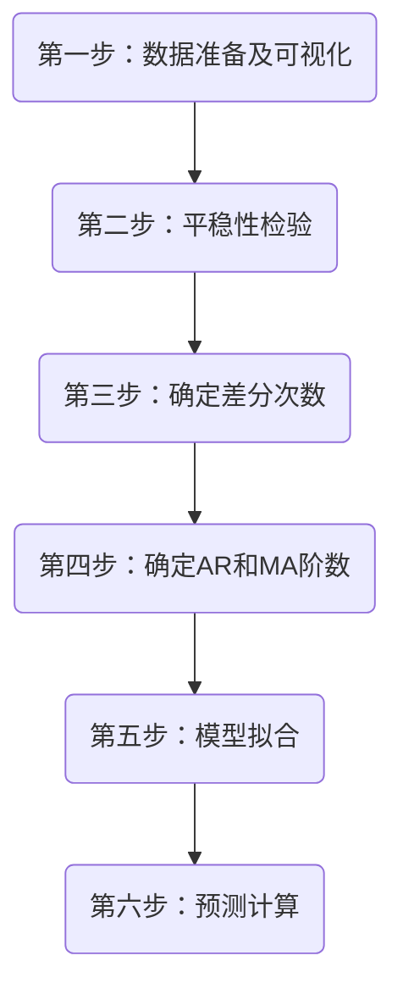
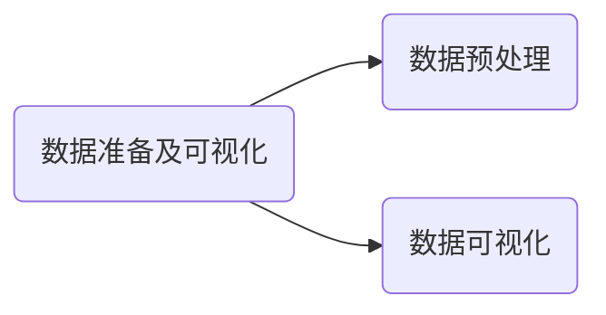
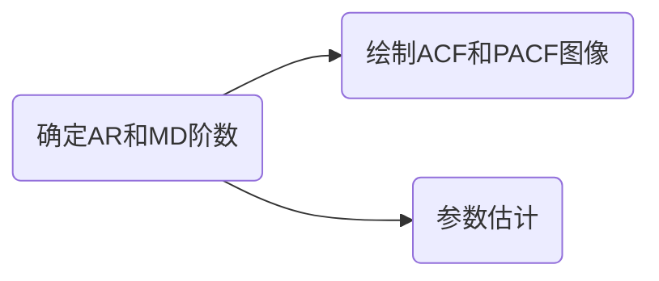

# 时间序列模型-ARIMA

## 模型概述

### 原理

\[
time_series = \{x_1,x_2,\dots,x_n\}
\]

基于时间数据,从中找规律,预测未来数据

### 特点

- 数据为按照时间**顺序排列**的数据
- 前后数据具有相关性(时间相关性)
- 不能用线性回归(不知道时间和其他信息的关系)

### 要素

- 季节性(周期性重复)
- 趋势性(从头到尾的大致方向)
- **随机性**(受其他因素波动)
- **平稳性**(某个变量不随时间变化)

\[
平稳性: \begin{cases}
特征: \begin{cases}
1.平均值稳定 \\
2.波动程度接近 \\
3.自相关结构不变(前后关系不变)
\end{cases} \\[20pt]
如何检查平稳性: \begin{cases}
1.画时序图 \\
2.统计检验
\end{cases}
\end{cases}
\]

## 模型解析

### ARIMA算法

\[
AR:自回归 \\
MA:移动平均算法 \\
I:差分逆过程(积分)
\]

### AutoRegressive(AR)

\[
X(t) = \varphi_1 X(t-1) + \varphi_2 X(t-2) + \dots + \varphi_p X(t-p) + \epsilon (t) \\[20pt]
X(t): 今天值 \\
X(t-p): p天前的值 \\[5pt]
\varphi_p: 历史值的影响程度 \qquad \begin{cases}
要求:
1.不能太大 \\
2.成指数衰减 \\
3.\varphi_1 < \varphi_2 < \dots < \varphi_p \qquad
\end{cases} \\
\epsilon (t): 随机误差 \\
p:阶数
\]

### 差分

\[
目的:将非平稳序列转换成平稳序列 \\[10pt]
\Delta Y_t = Y_t - Y_{t-1} \\
\]

### MoveAverage(MA)

\[
X(t) = \varepsilon (t) + \theta_1 \varepsilon(t-1) + \theta_2 \varepsilon (t-2) + \dots + \theta_q \varepsilon (t-q) \\[20pt]
X(t):今天值 \\
\varepsilon(t-p): p天前的影响 \\
\theta_q: 影响程度 \\
q: 阶数
\]

### ARMA

\[
前提:序列必须平稳 \\[10pt]
X(t) = \varphi_1 X(t-1) + \dots + \varphi_p X (t-p) + \varepsilon (t) + \theta_1 \varepsilon(t-1) + \dots + \theta_q \varepsilon (t-q)
\]

### ARIMA(p,d,q) p:自回归阶数 q:差分次数 q:移动平均阶数

\[
1.对原序列进行d次差分,得到平稳数据 \\
2.对平稳序列建立ARMA(p,q)模型 \\[5pt]
\varphi (B) (1-B)^a X(t) = \theta(B) \varepsilon (t)
\]

## 模型建立流程

