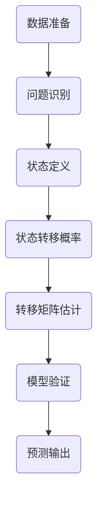

# 马尔可夫预测算法

## 算法概念

- 关于事件发生概率的预测算法
- 根据事件目前状态预测未来状况各种情况的概率

### 马尔可夫性(无记忆性)

系统未来状态只依赖于当前状态,与历史状态无关

\[
P(X_{\{t+1\}} = j | X_t = i, X_{\{t-1\}} = k,\dots,X_0 = m) = P(X_{\{t+1\}} = j | X_t = j)
\]

### 马尔科夫链

- 转移概率矩阵(从一个状态转移到另一个状态的概率形成的nxn矩阵) $\qquad P = [p_{ij}]$
- 每一行之和必须为1
- 要素:
      - 1.状态空间 $S = \{s_1,s_2,\dots,s_n\}$
      - 2.转移空间概率 $p_{ij} = P(X_{\{t+1\}} = j | X_t = j)(条件概率?)$
      - 3.转移概率矩阵 $P = [p_{ij}]$
      - 4.初始值分布 $\pi(0) = [\pi_1(0),\pi_2(0),\dots,\pi_n(0)] \qquad \pi(1) = \pi_2(0) ·P \qquad \pi(n) = \pi(0) · P^n$

## 适用性

1. 状态预测问题
2. 概率分布预测
3. 多步未来状态概率问题
4. 长期稳态行为分析
5. 状态分类与可达性分析

适用于具有以下特征的系统分析:

- **状态特征**：具有清晰离散状态
- **转移特征**：状态转移具有稳定随机性
- **无记忆性**：未来状态主要取决于当前状态

可解决的核心问题:

- 短期/长期状态概率预测
- 稳态行为分析
- 状态分类问题

## 基本思想

1. **状态定义**  
   将研究对象所有可能出现的、互斥且完备的情况划分成有限个离散的状态。

2. **转移矩阵估计**  
   量化系统从一个状态转移到另一个状态（或保持不变）的可能性。

3. **初始状态分布**  
   指定预测开始时（时间t=0），系统处于各个状态的概率。

4. **根据状态转移概率矩阵进行预测**  
   利用初始状态分布和转移概率矩阵，计算在未来任意时间点n（n=1,2,3,…）系统处于各个状态的概率分布。

## 模型建立过程

1. **构造概率模型**
   - 将目标问题转化为概率或期望值计算问题
   - 目标量 = \(E[g(X)]\)

2. **随机抽样**
   - 根据概率模型生成大量随机样本
   - \(X_1, X_2, \ldots, X_n \sim\) 某种分布

3. **统计计算**
   - 对样本进行统计分析，计算相关量
   - 计算 \(g(X_1), g(X_2), \ldots, g(X_n)\)

4. **结果估计**
   - 用样本统计量作为目标量的估计
   - 估计值 = \(\left(\frac{1}{n}\right) \sum_{i=1}^{n} g(X_i)\)

## 算法对比

|     算法     |   预测类型   | 不确定性处理 |   预测区间   |  数据量要求  | 历史依赖性 |
| :----------: | :----------: | :----------: | :----------: | :----------: | :----------: |
|   线性回归   |   单点预测   |   残差分析   |   置信区间   |     中等     |      低      |
|  非线性回归  |   单点预测   |   残差分析   |   置信区间   |      大      |      低      |
|   时间序列   |   单点预测   |   预测区间   |   预测区间   |      大      |      高      |
|   灰色预测   |   单点预测   |   残差检验   |      无      |      小      |      中      |
|   马尔可夫   |   概率分布   |   状态概率   |   概率区间   |     中等     |      中      |
|   蒙特卡洛   |   概率分布   |   随机模拟   |   置信区间   | 无需历史数据 |      无      |

## 算法流程

